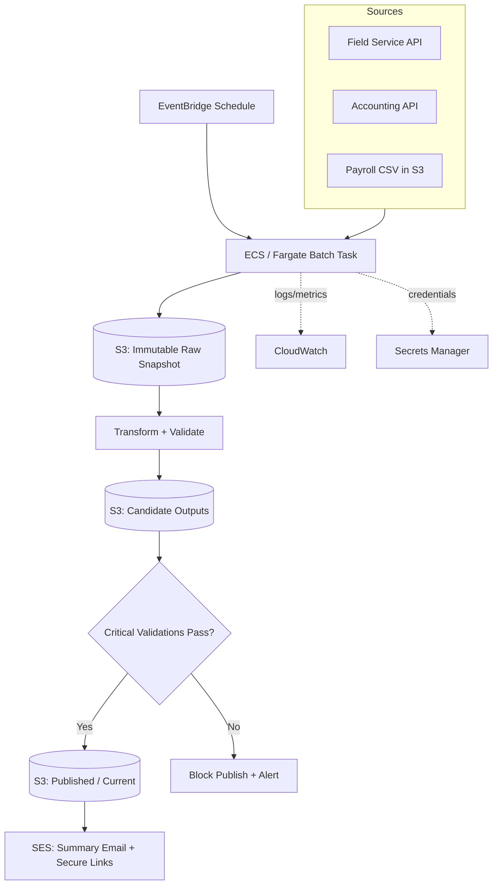

# Coresight POC 1 — Job Profitability Reporting Automation

A simulated Coresight client engagement that proves a painful weekly manual
report can be automated with a **simple, file-first AWS batch pipeline** —
no database, no data platform, no orchestration framework — until a real
requirement earns that complexity.

## The Problem

**ABC Mechanical** (a fictional 50–75 employee HVAC/service contractor)
spends 5–8 hours every Monday manually building a job-profitability report:
exporting data from three different systems, cleaning it in Excel, joining
records by hand, and chasing down discrepancies like duplicate invoices,
missing job IDs, and unmatched expenses.

## The Solution

A scheduled batch job that, every week, fully re-extracts data from all
three source systems, reconciles it into a trustworthy profitability report,
validates it, and emails the operations manager a summary with secure links
to the results — while flagging anything it can't confidently reconcile as
an exception for human review.

**Sources combined:**
- **Field Service / CRM API** (ServiceTitan-like) — customers, jobs, invoices
- **Accounting API** (QuickBooks-like) — vendor expenses, material purchases
- **Payroll CSV feed** — weekly timekeeping file dropped in S3

**Report calculates:** revenue, labor cost, material cost, gross profit, and
gross margin per job — with a companion exceptions report for anything that
can't be safely reconciled (unknown job codes, ambiguous expense matches,
canceled jobs with costs, etc.).

## Architecture

Deliberately simple: **one deployable batch task**, immutable S3 snapshots
for auditability, and a safe publish step that never overwrites a known-good
report with a broken one.

**Every run** gets its own immutable `run_id` prefix in S3 (raw snapshot,
candidate outputs, validation results, run manifest), so a failed or
suspicious run can be debugged without re-hitting the source systems, and a
bad run can never clobber the last known-good published report.

## What This Is Not

No Postgres/RDS, no data warehouse, no Step Functions, no Spark/Kafka, no
lakehouse, no incremental/CDC logic — every run does a full extract. See
[`docs/project-overview.md`](docs/project-overview.md) for the complete
spec, business rules, validation catalog, and build plan.

## Status

Early-stage POC. See `docs/project-overview.md` for the phased build order
(Phase 1: fake data generation → Phase 13: engagement retrospective).
